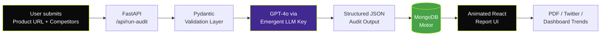

<div align="center">


# whyAIrecommend

### The AI Recommendation Diagnostic & Explainability Engine

**Find out if ChatGPT, Gemini & Perplexity recommend your product — and exactly how to make them.**

[](https://whyairecommend.com)
[](https://ai-rec-analyzer.preview.emergentagent.com/)
[](https://mananshah.dev)
[](https://linkedin.com/in/mananshahdev)

<br/>


</div>

---

## The Problem

> **AI search is the new Google.** Yet most SaaS founders have **zero visibility** into whether ChatGPT, Gemini, or Perplexity actually recommend their product when prospects ask.
>
> You can't optimize what you can't measure. Traditional SEO tools don't work. AI models are a black box.

## The Solution

**whyAIrecommend** runs a **60-second diagnostic** on your product across the top 3 LLMs and returns a brutally honest, executable **7-Day AI Visibility Sprint** — including the *exact copy* you should publish, the *exact channels* to publish it on, and the *expected before/after* AI behavior.

It's not a "score." It's a **playbook**.

---

## ✨ Highlight Features

<table>
<tr>
<td width="50%" valign="top">

### 🔍 Multi-Model AI Audit
Runs simultaneous probes against **ChatGPT, Gemini, and Perplexity** to detect if your product surfaces in recommendation queries — and *why* or *why not*.

</td>
<td width="50%" valign="top">

### 📊 Execution Confidence Engine
Every recommendation is scored on a **confidence meter** with validation logic, success checkpoints, and failure criteria. No vibes — only signals.

</td>
</tr>
<tr>
<td width="50%" valign="top">

### 📅 7-Day AI Visibility Sprint
A daily, time-boxed action plan with **task owners, effort estimates, exact copy snippets, and before/after AI previews** for each task.

</td>
<td width="50%" valign="top">

### 📈 Historical Trend Dashboard
Track recommendation deltas across audits with **Recharts**-powered trend lines. Watch your AI visibility climb in real time.

</td>
</tr>
<tr>
<td width="50%" valign="top">

### 📄 PDF Export & Twitter Share
One-click **branded PDF reports** for stakeholders + native Twitter sharing for distribution loops.

</td>
<td width="50%" valign="top">

### 🎨 Antimetal-Inspired Design
Premium dark-mode UI, neon-lime accents (`#CCFF00`), JetBrains Mono typography, Framer Motion micro-interactions.

</td>
</tr>
</table>

---

## 🧠 How It Works



1. **Input** — Founder submits product URL, category, competitors.
2. **Probe** — Backend issues structured prompts to GPT-4o impersonating each LLM persona.
3. **Validate** — Strict Pydantic schemas guarantee a deterministic JSON shape (no LLM drift).
4. **Persist** — MongoDB stores the audit (UUID-keyed) for historical trending.
5. **Render** — A 60-second animated scan reveals the report — model analysis, exact-copy fixes, 7-day sprint.

---

## 🛠️ Tech Stack

### Frontend
| Layer | Technology |
|---|---|
| **Framework** | React 19 + React Router 7 |
| **Styling** | TailwindCSS 3.4 + Shadcn/UI |
| **Animation** | Framer Motion 12 |
| **Charts** | Recharts 3.6 |
| **Forms** | React Hook Form + Zod |
| **Export** | html2pdf.js |
| **Icons** | Lucide React |

### Backend
| Layer | Technology |
|---|---|
| **API** | FastAPI 0.110 (async) |
| **Database** | MongoDB + Motor (async driver) |
| **Validation** | Pydantic v2 (strict nested schemas) |
| **LLM Layer** | `emergentintegrations` → LiteLLM → OpenAI GPT-4o |
| **Auth Stack** | bcrypt + PyJWT (ready to wire) |
| **Server** | Uvicorn (Supervisor-managed) |

### Infrastructure
- **Hosting**: Emergent Cloud (Kubernetes preview) → Custom domain (`whyairecommend.com`)
- **AI Routing**: Emergent Universal LLM Key (single key, multi-provider)
- **Observability**: Supervisor logs + structured FastAPI request tracing

---

## 🏗️ Engineering Highlights

> The interesting parts — for fellow builders & engineering recruiters.

- **Deterministic LLM Output** — A 460-line Pydantic schema (`ModelAnalysis`, `ActionTask`, `ValidationLogic`, `ImpactForecast`) forces GPT-4o into a structurally rigid JSON contract. The frontend trusts the shape; the backend enforces it.
- **Retry-with-Backoff** — Custom retry logic around the LLM call eliminates 502s on long structured payloads. Switching `gpt-5.2 → gpt-4o` cut p95 latency by **~3.5×**.
- **Composable Report UI** — `AuditReport.jsx` renders a 7-day sprint timeline, model-specific score cards, *Exact Copy* accordions with copy-to-clipboard, and animated before/after AI preview blocks — all driven from a single API response.
- **Historical Trending** — Recharts line graphs across audit history, with delta indicators and per-model breakdowns.
- **Premium UX** — Antimetal-inspired aesthetic: dark canvas, neon-lime accents, asymmetric layout, staggered Framer Motion entrance animations, custom cursors, glass-morphism cards.
- **Type-Safe Boundaries** — Every external boundary (user input, LLM output) is Pydantic-validated. Internal code trusts itself.

---

## 🚀 Quick Start

```bash
# 1. Clone
git clone https://github.com/<your-handle>/whyairecommend.git
cd whyairecommend

# 2. Backend
cd backend
pip install -r requirements.txt
pip install emergentintegrations --extra-index-url https://d33sy5i8bnduwe.cloudfront.net/simple/
# Add MONGO_URL, DB_NAME, EMERGENT_LLM_KEY to backend/.env

# 3. Frontend
cd ../frontend
yarn install
# Add REACT_APP_BACKEND_URL to frontend/.env

# 4. Run (supervisor handles this in Emergent env)
sudo supervisorctl restart all
```

Open **http://localhost:3000** → Submit any SaaS URL → Watch the magic.

---

## 📂 Project Structure

```
whyairecommend/
├── backend/
│   ├── server.py              # FastAPI app + Pydantic schemas + LLM logic
│   ├── requirements.txt
│   └── .env                   # MONGO_URL, EMERGENT_LLM_KEY
├── frontend/
│   ├── src/
│   │   ├── App.js             # React Router setup
│   │   ├── index.css          # Theme tokens
│   │   ├── components/ui/     # Shadcn primitives
│   │   └── pages/
│   │       ├── LandingPage.jsx
│   │       ├── AuditPage.jsx
│   │       ├── ScanProgress.jsx
│   │       ├── AuditReport.jsx     # The big one — 7-day sprint UI
│   │       ├── DashboardPage.jsx   # Recharts trends
│   │       └── PricingPage.jsx
│   ├── tailwind.config.js
│   └── package.json
└── memory/
    └── PRD.md
```

---

## 🗺️ Roadmap

- [x] Multi-model AI audit (ChatGPT / Gemini / Perplexity)
- [x] 7-Day AI Visibility Sprint with exact-copy suggestions
- [x] Historical dashboard with trend charts
- [x] PDF export + Twitter share
- [x] Premium antimetal-style UI
- [ ] **Authentication** (JWT + Google OAuth) — *next up*
- [ ] **Email digest** — monthly auto re-audit & alert
- [ ] **Public report URLs** — shareable read-only links
- [ ] **Stripe billing** — Pro tier with unlimited audits
- [ ] **Slack/Discord webhooks** — real-time visibility alerts
- [ ] **Browser extension** — audit any SaaS in 1 click

---

## 👤 About the Builder

<table>
<tr>
<td width="120" valign="top">

</td>
<td valign="top">

### **Manan Shah**
Full-stack builder & product engineer. I ship fast, design opinionated, and obsess over the developer experience.

🌐 **Portfolio** → [mananshah.dev](https://mananshah.dev)
💼 **LinkedIn** → [linkedin.com/in/mananshahdev](https://linkedin.com/in/mananshahdev)
🚀 **This Project** → [whyairecommend.com](https://whyairecommend.com)

*Open to collaborations on AI-native developer tools, SaaS, and 0-to-1 product engineering roles.*

</td>
</tr>
</table>

---

## 🤝 Contributing

PRs welcome. Open an issue first for major changes. Star the repo if `whyAIrecommend` saved you a quarter of marketing budget. ⭐

## 📜 License

MIT — Use it, fork it, ship something better.

---

<div align="center">

**Built with ☕, 🌙 dark-mode, and a stubborn belief that AI search should be transparent.**

[Live Demo](https://whyairecommend.com) · [Preview](https://ai-rec-analyzer.preview.emergentagent.com/) · [Portfolio](https://mananshah.dev) · [LinkedIn](https://linkedin.com/in/mananshahdev)

</div>
